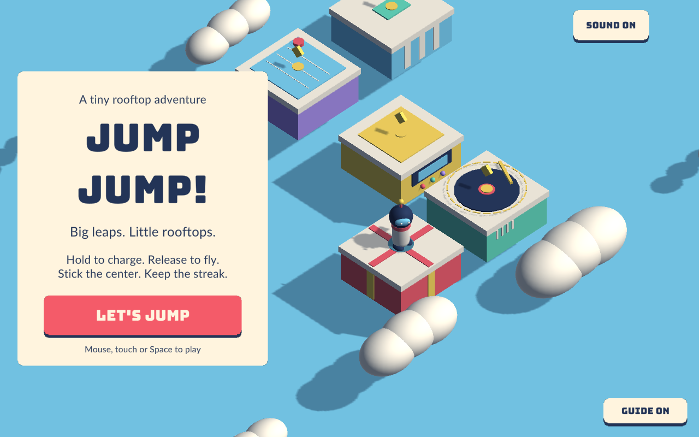
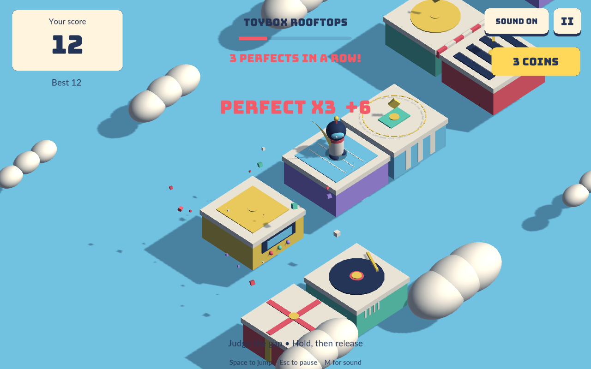

# Jump Jump — Pocket Arcade

A Unity 3D arcade game inspired by hold-and-release jumping, with eight toy rooftops, a tiny courier, responsive UI, synthesized music, sound and confetti.

Hold the mouse, touch, or Space to charge; release to jump. Land in the center for coins and combos. Escape pauses; M toggles sound. Space or Enter starts another run.

**[Play in your browser](https://stevenli-phoenix-work.itch.io/jump-jump)** · **[Download desktop releases](https://github.com/StevenLi-phoenix/unity-wechat-jumper/releases)**

- [Project, local builds and tests](./docs/DEVELOPMENT.md)
- [Creating a desktop release](./docs/DEVELOPMENT.md#desktop-releases)
- CI validates changes and builds Unity WebGL; main-branch pushes publish to itch.io.
- Version tags trigger macOS, Windows and Linux builds and attach the complete players to a GitHub Release.

