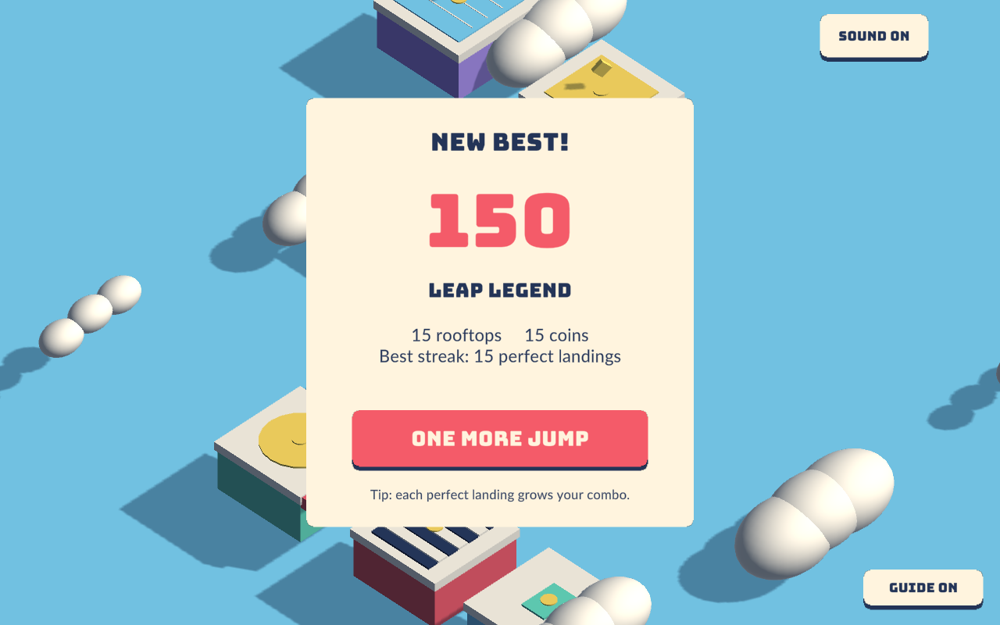

# Jump Jump

A colorful Unity 6 hold-and-release jumping game. Guide Pip across a cloud archipelago of gift boxes, record players, arcade cabinets, pools, pianos, diners and cassette rooftops.

Hold the mouse, touch, or Space to charge; release to jump. The optional white charge marker helps beginners judge the distance. Land in the center for coins and a growing perfect streak. Escape pauses, M toggles sound, and Space or Enter starts another run.

The game includes a start screen, pause menu, run results, saved best score, procedural music and sound effects, squash and stretch, trails, platform bounce, confetti, and portrait-aware UI. Platforms and effects are bounded during long runs. Desktop screenshot fixtures do not alter saved scores.

## Run and build

Open Jumper/ in Unity **6000.6.0f1**, open Assets/JumpJump.unity, and press Play. The scene bootstraps its geometry, camera and interface at runtime.

    bash scripts/build-webgl.sh
    node --test scripts/*.test.mjs
    bash scripts/test-desktop.sh

The WebGL bundle is written to Jumper/Build/WebGL. Serve that directory over HTTP. The desktop test script builds a macOS player, simulates fifteen perfect jumps in landscape and portrait, checks pause/results/retry and platform bounds, and captures screenshots in /tmp/jumper-*.png.

The editor runs 38 gameplay and audio checks before building. Fonts use pre-generated TextMeshPro atlases to keep changing scores stable.

## Source

- JumpSession.cs: input phases, charge, scoring, combo and run statistics.
- JumpWorld.cs: eight rooftop types, character, clouds, pooled confetti and materials.
- JumpHud.cs: responsive menus and HUD.
- JumpAudio.cs: synthesized music and feedback sounds.
- JumpGame.cs: input, jump animation, camera and end-to-end desktop checks.
- BuildGame.cs: repeatable scene and player builds.

CI lives in this repository, with repository-local Unity and butler secrets. Pushes to main publish the stevenli-phoenix-work/jump-jump:html5 channel. Never put credential values in source or logs.

Original procedural artwork. Bungee and Lato fonts are distributed under the included SIL Open Font Licenses. TextMeshPro essential resources retain their bundled notices.

